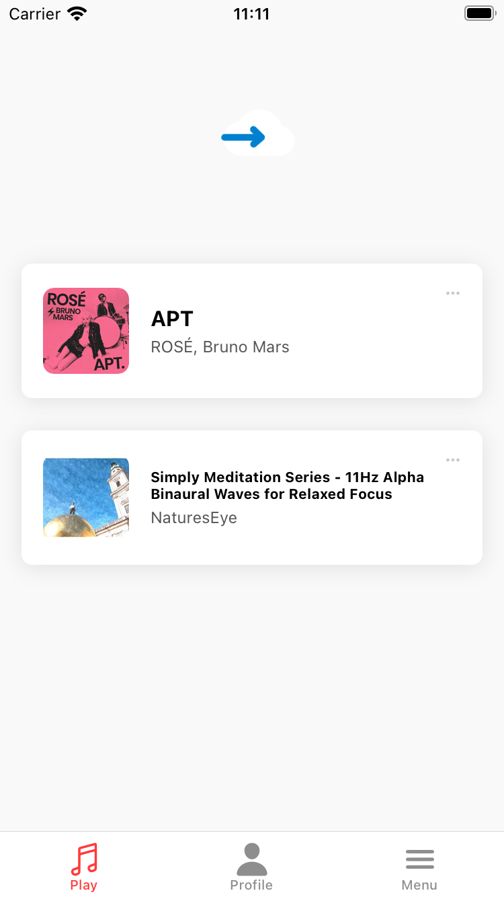
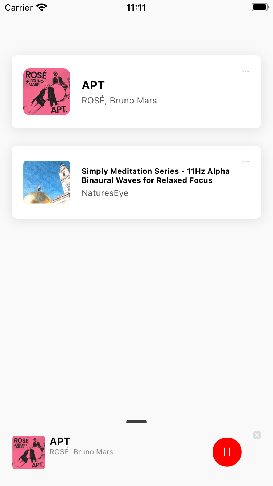
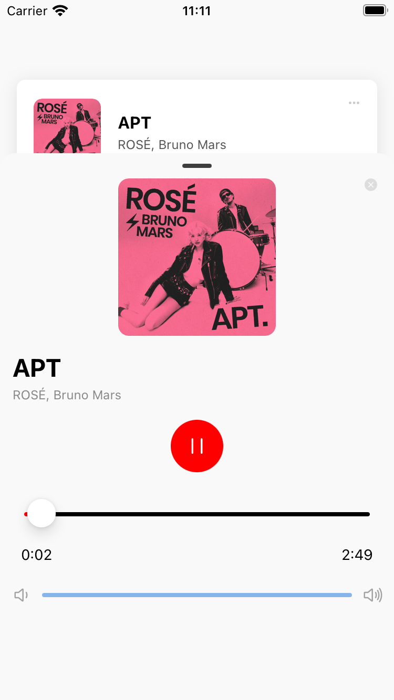

# **Binaural Beats Audio App White Paper**


<div style="display: flex; justify-content: center;">
  <video autoplay muted loop width="30%" controls>
    <source src="./videos/demo.mp4" type="video/mp4">
    Your browser does not support the video tag.
  </video>
</div>

<div style="display: flex; justify-content: center; gap: 10px;">





</div>

## **Executive Summary**

The **Binaural Beats Audio App** is a cutting-edge mobile application designed to provide users with a seamless experience in accessing and playing binaural beats audio tracks. Leveraging modern mobile and backend technologies, the app achieves high performance, scalability, and an intuitive user experience.

Key technical features include:
- **High-Performance Streaming**: Implements `Range` header support for efficient audio streaming, optimizing server resource usage and reducing latency.
- **Offline and Background Playback**: Supports downloading audio tracks for offline usage and integrates background playback with media controls.
- **Dynamic and Interactive UI**: Uses **Reanimated 3** for smooth animations and **Rive** for interactive micro-interactions.
- **Advanced Analytics System**: Features a pluggable analytics framework compatible with Firebase Analytics and other platforms for tracking user behavior.
- **Scalable Architecture**: Designed for modularity, ensuring easy extensibility and maintainability across both frontend and backend systems.

---

## **Technical Features**

### **Frontend (React Native)**

#### **1. Efficient Audio Streaming**
   - Implements byte-range requests using `Range` headers to enable partial audio downloads.
   - Optimized for low-latency playback even with high-resolution audio files.
   - Reduces bandwidth usage by downloading only the required segments of the audio file during playback.

#### **2. Offline and Background Playback**
   - Audio files can be downloaded and stored securely using **expo-file-system**.
   - Background playback is enabled via Expo's media controls, allowing users to play/pause/seek audio even when the app is minimized.

#### **3. Dynamic and Interactive UI**
   - Smooth and responsive animations powered by **Reanimated 3**, providing:
     - Shared transitions between UI states (e.g., Quick Player to Full Player).
     - Progress bars and sliders with real-time feedback using shared values.
   - **Rive** animations for micro-reactions, such as toggle buttons and visual indicators, improving user engagement.

#### **4. Advanced Analytics System**
   - Modularized analytics framework supports Firebase Analytics and custom adapters.
   - Tracks user behavior such as audio playback, downloads, and UI interactions.
   - Easily extensible for adding new analytics providers or custom metrics.

#### **5. Robust and Scalable Architecture**
   - Modular React Native components ensure easy extension and maintenance.
   - State management optimized using shared values to reduce unnecessary re-renders.

---

### **Backend (Golang)**

#### **1. Audio Streaming with Metadata**
   - RESTful API serves audio files with `Range` header support for efficient streaming.
   - Additional metadata (e.g., title, author, duration) is provided alongside audio files.

#### **2. Optimized Performance**
   - Built using the **Gin** framework, running in `release` mode for maximum performance.
   - Implements concurrent request handling and byte-range support for large-scale streaming.

#### **3. Extensible Design**
   - Metadata and audio files are organized for efficient retrieval and management.
   - Supports horizontal scaling via Docker containers, ensuring the system can handle thousands of users simultaneously.

#### **4. Secure Offline Downloads**
   - Metadata and download management integrated with client apps for secure and consistent offline playback.

---

## **Setup Instructions**

### **Frontend Setup**

#### **Prerequisites**
- Node.js and Yarn installed on your system.
- Expo CLI for running the app.

#### **Steps**
1. **Clone the repository**:
   ```bash
   git clone https://github.com/Winglonelion/binaural-beats-audio-app.git
   ```

2. **Navigate to the project directory**:
   ```bash
   cd binaural-beats-audio-app
   ```

3. **Install dependencies**:
   ```bash
   yarn install
   yarn pod
   ```

4. **Run the development server**:
   ```bash
   yarn start
   ```

5. **Run the application on iOS**:
   ```bash
   yarn ios
   ```

6. **Run the application on Android**:
   ```bash
   yarn android
   ```

#### **Optional**
To enable offline mode, ensure your backend API is accessible by replacing `localhost` with the server IP in the frontend code.

For more detailed information, please read [Frontend README](https://github.com/Winglonelion/binaural-beats-audio-app)

---

### **Backend Setup**

#### **Prerequisites**
- Go installed (version 1.21 or later).
- Docker installed for containerized deployment.

#### **Steps**

**1. Clone the repository**

```bash
git clone https://github.com/Winglonelion/binaural-beats-audio-services.git
cd binaural-beats-audio-services
```

**2. Quick start server with Docker**
  ```bash
  docker-compose up -d
  ```

**3. Install dependencies**

Dependencies are managed via `go.mod`. Run the following command to ensure all dependencies are installed:

```bash
go mod tidy
```

**4. Run the server**

Start the backend server:

   ```bash
   go run main.go
   ```

   The server will be available at `http://localhost:8080`.

**5. API Endpoints**:

- `GET /api/audio` - Returns a list of available audio files.
- `GET /api/audio/{file_name}` - Streams the selected audio file.
- `GET /api/download/{file_name}` - Downloads the audio file.


For more detailed information, please read [Backend README](https://github.com/Winglonelion/binaural-beats-audio-services)


## **Future Enhancements**

1. **Caching Mechanisms**:
   - Implement caching for frequently accessed audio files to reduce server load.

2. **Improved Offline Analytics**:
   - Cache user activity data offline and sync with the backend when the device reconnects.

3. **Personalized Recommendations**:
   - Use machine learning to suggest audio tracks based on user behavior and preferences.

4. **Cross-Platform Support**:
   - Extend compatibility to web and desktop platforms for a unified experience.

---

## Checklist
- [x] Well structured codebase
- [x] Auto Linting and formatter setuped with strong rules/conventions.
- [x] Code optimized performance with technicals like FlashList, memorization, Reanimated, Rive
- [x] Apply Singleton, Factory and Provider design patterns
- [x] Player UI with play/pause button
- [x] Volume slide
- [x] Progress slider 🚀
- [x] Animation when playing
- [x] Error handling & loading states
- [x] Background audio playback
- [x] Audio frequence visualizer
- [x] Full featured Offline mode
- [x] Basic analytics implementation
- [x] Deployed BE to Render
- [x] Basic unit testing

## **Conclusion**

The **Binaural Beats Audio App** is a robust and scalable solution for delivering high-quality binaural beats. By leveraging advanced streaming techniques, dynamic animations, and modular architecture, the app is both performant and user-friendly.

For more details, visit the [GitHub Repository](https://github.com/Winglonelion).
